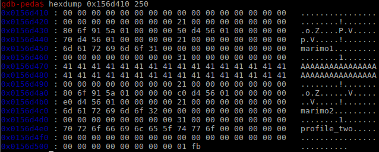
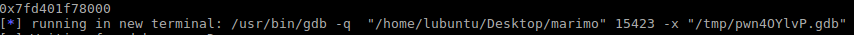
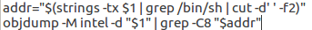
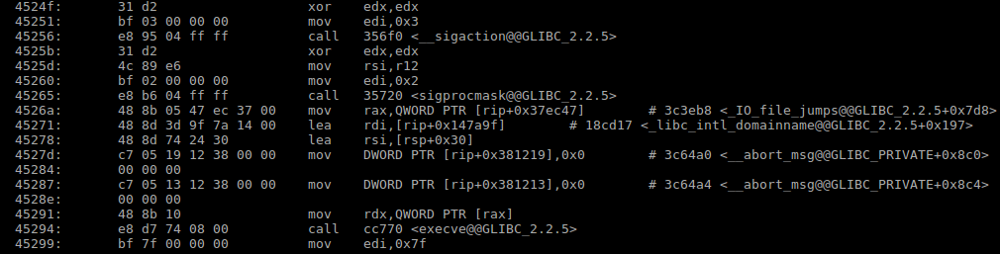
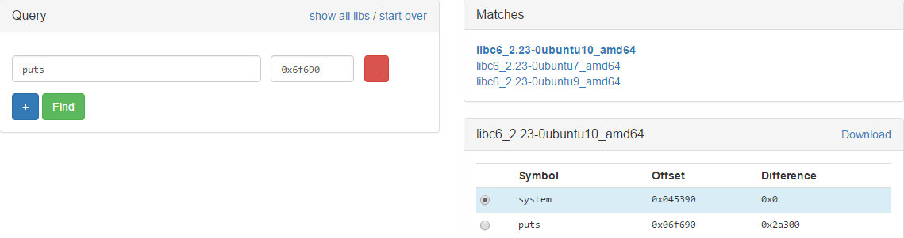

# SuperMarimo

**Category:** pwn
**Points:** 375

## Reconnaissance

When executing the binary we're met with a simple ascii menu that allows us to buy/sell/view the so called marimos, the only problem is is that to begin doing anything you need money to buy a marimo. Because we have no money we start analysing the binary in a disassembler to find a function that lets us spawn marimos by typing "show me the marimo" as a menu option. After entering that you're asked to name your marimo and write a profile for it which has a limit of 32 characters. So far neither the name nor the profile buffer seems vulnerable to an overflow and there also isn't any funky free() shenanigans. Diving back into the disassembly we find we can also edit the profile and there's no bounds check for it that time. This will be our attack vector.

## Exploiting

We know the profile buffer is overflowable and we know the profile buffer comes at the end of the entire allocated struct of sorts in memory. If we allocate another marimo right after the first one we might be able to overflow into some useful fields. We first allocate two marimo using the "show me the marimo" command and name them "marimo1" and "marimo2" with the first marimo having its profile buffer completely filled to clearly see the boundary in memory like so:

  

We can see that right after the filled profile buffer ("A" * 32) the next marimo's buffer starts starting with the malloc header then a uint64_t housing the timestamp it was created at and after that two pointers to the name and the profile buffer respectively. Out of the 3 fields we can overflow, 2 of them seem like a reasonable way to try finding an exploit with.

Each pointer has their own use in the final exploit; using the View marimo option we can read from wherever the name pointer points, and using the profile pointer we can write anywhere that one points to. To pop the eventual shell I chose to use a one-gadget-RCE, but it should also be possible to call system with "/bin/sh" manually.

### Setting up the exploit

To use a one-gadget-RCE we need to know a few things:
* libc's base address, because the binary has partial RELRO enabled
* the offset from libc's base for our one-gadget 
* the address of a got entry we can use to point to our gadget

#### 1. Finding libc's base address

We overwrite the name pointer to point to a libc function's got entry using this:  
`p64(exe.got['puts'])`

We read out the name pointer using the view marimo option, the name now points to the got entry ot puts giving us the address of puts in memory:  
`puts_addr = u64(proc.recvline_startswith("name : ")[7:].ljust(8, '\x00'))`

We get the offset of puts from the relevant libc's base:  
`libc = ELF('/lib/x86_64-linux-gnu/libc.so.6')`  
`libc_puts_addr = libc.symbols['puts']`

Then we calculate the address libc is based at currently:  
`libc_base = puts_addr - libc_puts_addr`

Result will look similar to this:

  

#### 2. Finding a suitable one-gadget-RCE

A one-gadget-RCE is a gadget, that when pointed to, loads "/bin/sh" into the RDI register and calls [execve](https://linux.die.net/man/2/execve). (to read about the specifics look [here](http://j00ru.vexillium.org/slides/2015/insomnihack.pdf))
One other important side-note is that depending ont he gadget you choose, a different value is loaded into RSI. It can be anything from RSI being ignored to `mov rsi, [rsp + 0x30]` meaning RSI needs to be 0 or whatever is at `[rsp + 0x30]` has to be 0 respectively.

One way to find gadgets for the libc you need quickly is to use this little bash script(found [here](https://github.com/inaz2/minipwn/blob/master/one-gadget-rce.sh)):

  

Like so:

  

The result dumps every location where the string "/bin/sh" is used in libc out to the terminal with its surrounding instructions, now rests the task of selecting a good address to jump to.
First we need execve to be executed after the string is loaded into RDI, second we need to find which gadget ends up giving us an empty RSI register. This can be done by trying a few out or analysing the disassembly.
For this exploit I went with this one(0x4526a):

  

#### 3. Finding a got entry we can overwrite to trigger our gadget

This one is easy. We know puts has an entry in the got and we know that it is used often, so it will immediately trigger our exploit.
`p64(exe.got['puts'])`

### Exploiting it

With all the info gathered all that rests now is overwriting the profile pointer with the pointer to a got entry of our choice, modify the profile of the marimo, and write to it our one-gadget-RCE address based off the current libc base.

result: `But_every_cat_is_more_cute_than_Marimo`

###### bonus info
[site to find the libc version your dealing with based on offsets](https://libc.blukat.me/)

  

