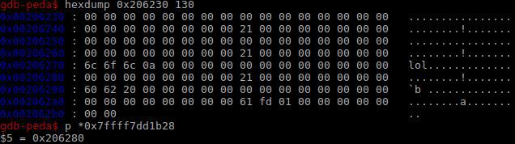
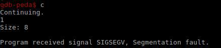

# flea_attack

**Category:** pwn
**Points:** 200

**Description:** 

> nc problem.harekaze.com 20175

## Write Up

file:
`flea_attack.elf: ELF 64-bit LSB executable, x86-64... not stripped`

## Reconnaissance

When looking through the binary in your favourite disassembler you will be met with a fairly short (not stripped) main function with 4 sub-functions that stand out by name alone:
    open_flag
    gets_comment
    add_name
    del_name

The open_flag function seems to exit if it can't find the file /home/flea_attack/flag, because we want to test our exploit locally we write a string into a file named flag at that location as root and give our current user the necessary permissions. If the flag is present on the system the function will read its contents into a 0x30 byte buffer in the .bss section. Next, in the function gets_comment, we see it reads in user-input into a 0x60 byte char array also located in the .bss section. For those who paid attention it would have been a give away that the flag buffer being located shortly after the comment buffer is a minor hint as to how to eventually exploit the binary. From the other two functions one allow us to malloc a buffer of our preferred size, write bytes into it, and write out its pointer to stdout, and the other allows us to give a pointer to the program which then gets passed to free().

## Exploiting

To keep this relatively short I'll assume a bit of previous knowledge on the workings of the linux heap(for reference: http://www.blackhat.com/presentations/bh-usa-07/Ferguson/Whitepaper/bh-usa-07-ferguson-WP.pdf).

### Finding the exploit

Since we can create any number/size of heap allocations and pass the pointer of any address as many times as we want to the free() function, we should be able to fairly easily pull of a double free.
We start by allocating 3 buffers each of a size that still qualifies as a fastbin size(fastbin has 9? bins each holding a linked list of free'd buffers of a particular length. Fastbin is nice for this because it uses a singly linked list and a LIFO system of ordering), we take an 8 byte buffer for testing purposes. After allocating all 3 we delete all 3 giving us a memory layout like this for 3 buffers allocated at 0x206250, 0x206270, 0x206290:

  

We can see 3 heap headers in memory (0x21 meaning size of entire buffer being 0x20 and previous chunk in use), we can also see 2 pointers that were written into the buffer after freeing them to add the chunks to the fastbin free list. Seeing as we deleted the 3rd chunk at 0x206290 last we have the head of the linked list pointing to that chunk(LIFO), that chunk then points to the 2nd chunk which we free'd second and same for the 1st. What this means is that malloc(given that a chunk of a similar size is allocated) will take the pointer at the head of that list, perform some sanity/security checks on the pointer, remove the current pointer from the head of the list and take the next pointer stored in the current object and put it at the head, then return the original head pointer to the user for use.

Because of security we can't free the buffer we freed last another time, but what happens if we free the buffer we freed second again?:

  

It will copy the pointer that is currently at the head of the list into the next pointer of the buffer we just freed and put a pointer to the buffer we just freed into the head of the list(LIFO). Which means that now we will have a list that goes pointer_2nd -> pointer_3rd -> pointer_2nd.

If we now allocate a buffer it will return the pointer at the head of the list pointer_2nd:

  

  

You can see we overwrote the next pointer field of the chunk, which wouldn't be a problem if we couldn't free it another time, but we can! The list got updated by removing the pointer at the head of the list and moving the pointer in the next_pointer field of the chunk to it meaning it is now pointer_3rd -> pointer_2nd -> (whatever we overwrote the next_pointer field with just now).

if we alloc another chunk:

  

  

We can see that malloc, as expected, returned the pointer to the 3rd chunk for us to write to and the head of the fastbin linked list is now pointing, once again, to the 2nd chunk. The bug happens here. If we once again ask malloc to provide us with a pointer to a new chunk it will read out the fastbin list and give us the pointer to the 2nd chunk, update the head of the list with whatever is currently in the next_pointer field of the chunk it returned and return a pointer to the current chunk to us. The head of the fastbin list will now hold 0x000000000a6c6f6c ("lol\x0a"):

  

 if we try calling malloc one more time and malloc tries to provide us with a chunk at this pointer location we will 99/100 times segfault because of security contraints:

  

### Exploiting it

To exploit this we need to be aware of one more effect of the add_name function, that is, it calls printf with the pointer just returned by malloc, thus printing out (almost)anything that's at its location.
We can take advantage of this by having it point to a buffer that holds the flag. If we just point it at the flag we will get a "memory corruption (fast)" crash meaning we didn't adhere to one of the checks malloc performs when returning a chunk: the size field of the chunk has to be within bounds of the current fastbin size. We noted earlier that the flag buffer follows the the comment buffer pretty closely meaning we might be able to point it at the, by us provided, comment buffer and have it match a fastbin size, then write characters into that buffer until the start of the flag and have the printf read out all our characters + the flag. 

There's one more, minor, hurdle to overcome. If we write a string that doesn't fill the entire size of the comment buffer the custom fgets function will replace the last byte with "\x0a":

  

We can't point our malloc at 0x0a because the size is too small to fit the current fastbin's size constraints, if we point it to the byte before the size will be 0x0a6c which is also way outside the range. The solution is the fill the entire buffer and have the very last byte be a size that fits the constraints:

  

Now we can point our controlled malloc to the end of our comment and write bytes until the flag to get:
`HarekazeCTF{5m41l_smal1_f1ea_c0n7rol_7h3_w0rld}`